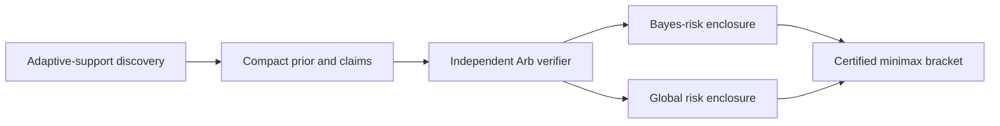

# Bounded Normal Minimax Certificate

[](https://github.com/Maar10Herr/Bounded-Normal-Minimax-Certificate-Public/actions/workflows/ci.yml)
[](LICENSE)
[](https://orcid.org/0009-0005-8721-6588)

A deterministic, independently verified computation of the minimax risk for a
normal mean bounded to `[-4, 4]` under squared-error loss.

> [!NOTE]
> **Computer-assisted research result.** The final statement is an
> outward-rounded Arb certificate for the scalar bounded-normal model at
> `m = 4`. The verifier checks a supplied prior and its global risk bound; it
> does not certify finite-time convergence of the discovery algorithm.

**[Read the paper](paper/Bounded_Normal_Mean_Minimax_Certificate.pdf)** ·
**[Inspect the certificate](certificates/final/m4_epsilon_1e-8_arb.json)** ·
**[Download the latest release](https://github.com/Maar10Herr/Bounded-Normal-Minimax-Certificate-Public/releases/latest)**

## Certified result

For

```math
Y\sim\mathcal N(\theta,1),\qquad \theta\in[-4,4],
```

with squared-error loss, the minimax risk `v*` satisfies

```math
0.8150887565050
\le v^* \le
0.8150887615302.
```

The certified gap is below `5.026 × 10^-9`. The supplied symmetric prior has
positive support levels

```math
(0.5984699814893856,\ 2.1264117002421385,\ 4)
```

with total level masses

```math
(0.36699366016033996,\ 0.3994285510645993,\ 0.23357778877506074),
```

split equally between positive and negative atoms.

## Verify the result

The lockfile targets CPython 3.13 and includes NumPy, Pillow, and python-flint.

```sh
uv sync --frozen
uv run python src/verification/verify_certificate_arb.py \
  certificates/final/m4_epsilon_1e-8_arb.json
```

Run the corruption audit and complete test suite:

```sh
uv run python scripts/run_corruption_audit.py
uv run pytest -q
```

The verifier rejects altered support, masses, risk intervals, numerical
settings, and malformed certificates.

## Computation and trust boundary



The discovery and verification paths use different numerical representations:

| Stage | Main method | Role |
|---|---|---|
| Discovery | Kempthorne exchange with adaptive support; float64 optimization | Finds a strong candidate prior |
| Separation | Continuous branch-and-bound over `[0, 4]` | Locates worst-case risk without a fixed parameter grid |
| Verification | 192-bit Arb balls, interval Simpson remainder, Gaussian tail bounds | Recomputes an outward-rounded proof |
| Corruption audit | Mutated certificates and hostile numerical cases | Tests fail-closed behavior |

The final verifier reconstructs posterior ratios, Bayes risk, curvature
enclosures, and complete branch coverage from the compact certificate. It
shares the mathematical specification with the discovery solver but does not
import its optimization state or branch tree.

## Contribution and relation to prior work

The outer adaptive-support strategy follows Kempthorne's exchange algorithm.
Classical bounded-normal results and numerical risk calculations were developed
by Casella and Strawderman, Feldman and Brown, Donoho, Liu and MacGibbon, and
Gourdin, Jaumard and MacGibbon. Montiel Olea and Zubova provide a recent
stochastic mirror-ascent method with finite-sample approximation guarantees.

This release contributes a specialized deterministic implementation, a
grid-free continuous separator for the scalar Gaussian problem, and an
independent outward-rounded certificate that can be replayed from a compact
artifact.

Key references:

- Kempthorne, *SIAM Journal on Scientific and Statistical Computing* 8 (1987),
  [doi:10.1137/0908028](https://doi.org/10.1137/0908028)
- Casella & Strawderman, *The Annals of Statistics* 9 (1981),
  [doi:10.1214/aos/1176345527](https://doi.org/10.1214/aos/1176345527)
- Gourdin, Jaumard & MacGibbon, *SIAM Journal on Scientific Computing* 15 (1994),
  [doi:10.1137/0915002](https://doi.org/10.1137/0915002)
- Montiel Olea & Zubova, *Approximate Minimax Estimation of a Bounded Normal
  Mean via Stochastic Mirror Ascent* (2026),
  [arXiv:2607.05350](https://arxiv.org/abs/2607.05350)
- Moore, Kearfott & Cloud, *Introduction to Interval Analysis* (2009),
  [doi:10.1137/1.9780898717716](https://doi.org/10.1137/1.9780898717716)

The paper gives the complete claim-lineage table and bibliography.

## Reproducibility record

The recorded clean verification used 192-bit arithmetic, tail cutoff `A = 8`,
2,048 Simpson panels per point-risk calculation, 512 curvature cells, and 567
branch nodes. The paper reports the machine and software environment alongside
the certificate settings so that numerical scope is distinguishable from
portable mathematical claims.

## Repository map

```text
certificates/final/  compact accepted certificate
src/solver/          adaptive-support discovery and certified solver
src/verification/    independent Arb verifier
scripts/             corruption audit
tests/               identities, joint bounds, and negative verification tests
paper/               technical paper
```

## Citation

Use the preferred paper citation in [`CITATION.cff`](CITATION.cff) and cite the
specific release used. Author:
[Maarten Linus Herrmann](https://orcid.org/0009-0005-8721-6588), ORCID
[`0009-0005-8721-6588`](https://orcid.org/0009-0005-8721-6588).

## License

The software is licensed under [GPL-3.0-or-later](LICENSE). The paper is
copyright © 2026 Maarten Linus Herrmann; all rights reserved. The reciprocal
license keeps distributed changes to the solver and verifier available for
inspection under the same terms. Cited publications and the mathematical work
they contain remain subject to their original terms.
